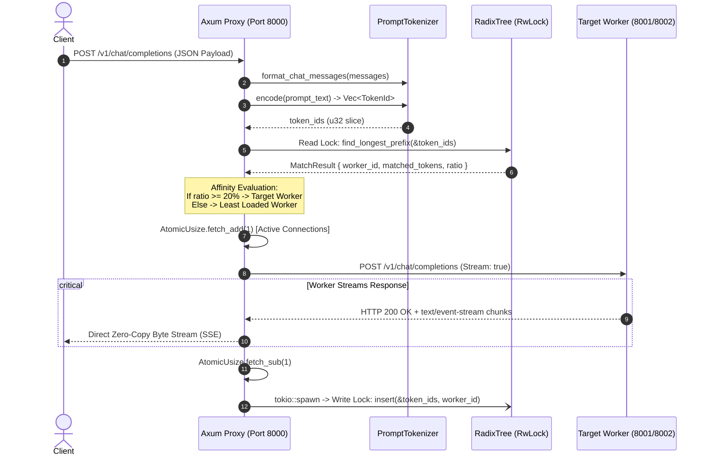

# Architecture Specification: Prefix-Caching KV Router

This document serves as the formal technical architecture and systems design specification for the **Prefix-Caching KV Router**. It details the request lifecycle, data structures, concurrency invariants, routing algorithms, and networking mechanics.

---

## 1. System Overview & Context

Modern Large Language Model (LLM) serving stacks (e.g., vLLM, SGLang, TensorRT-LLM, Ollama) feature **KV cache prefix reuse** to eliminate redundant attention computation during prompt prefill. However, when multiple worker nodes run behind a traditional Layer-7 load balancer (NGINX, AWS ALB, Round-Robin), requests with identical prompt prefixes are distributed randomly across workers. This causes **cache fragmentation**, duplicate GPU memory consumption, and severe tail-latency spikes (**Time-To-First-Token / TTFT**).

The **Prefix-Caching KV Router** is an asynchronous Layer-7 Reverse Proxy written in **Rust** (`Tokio` + `Axum`). It inspects prompt token sequences in-flight and routes requests with maximum prefix overlap to the worker holding the warm KV tensors in its GPU memory.

```
                           Concurrent Client Requests
                                       │
                                       ▼
             ┌───────────────────────────────────────────────────┐
             │       Rust L7 Reverse Proxy (Axum / Tokio)        │
             │                                                   │
             │  1. Ingest JSON /v1/chat/completions              │
             │  2. Fast BPE Tokenization (< 50μs)                │
             │  3. Longest Prefix Match (LPM) in Radix Tree      │
             │  4. Affinity Score vs. Worker Queue Balancing     │
             │  5. Asynchronous Background Tree Update           │
             └─────────────┬───────────────────────┬─────────────┘
                           │                       │
           Warm Cache Hit  │                       │  Cold / Balanced
                           ▼                       ▼
              ┌─────────────────────────┐     ┌─────────────────────────┐
              │ Worker 1 (Port 8001)    │     │ Worker 2 (Port 8002)    │
              │   vLLM / Ollama Node    │     │   vLLM / Ollama Node    │
              │  [Warm KV: ~20ms TTFT]  │     │  [Cold KV: ~180ms TTFT] │
              └─────────────────────────┘     └─────────────────────────┘
```

---

## 2. End-to-End Request Lifecycle

The following sequence illustrates the exact execution flow of a single incoming `/v1/chat/completions` request through the proxy pipeline:



### Step Breakdown:
1. **JSON Parsing & Prompt Normalization:** The client sends an OpenAI-compatible JSON payload. The proxy deserializes the request using `serde_json` and concatenates chat messages using ChatML formatting (`<|im_start|>{role}\n{content}<|im_end|>`).
2. **Sub-100μs Tokenization:** The HuggingFace BPE tokenizer converts the prompt string into a `Vec<u32>` of token IDs.
3. **Radix Tree Spatial Query:** The proxy acquires a shared read lock on the in-memory Radix Tree to perform a Longest Prefix Match (LPM).
4. **Affinity vs. Load Decision:** The router evaluates whether the match ratio justifies routing to the warm worker or if the worker is overloaded, falling back to the least-loaded worker.
5. **Connection Accounting:** An atomic counter (`active_requests`) is incremented lock-free.
6. **Zero-Copy Forwarding & SSE Streaming:** The request is forwarded via `reqwest`. Response bytes are streamed directly to the client without memory buffering.
7. **Asynchronous Cache Registration:** A background Tokio task updates the Radix Tree with write locks, decoupled from the client's critical path.

---

## 3. Core Component Architecture

```
src/
├── main.rs         # Axum Server, Routing Engine, HTTP Proxy & SSE Stream Handler
├── radix.rs        # In-Memory Compressed Radix Tree (Patricia Trie) & LPM Search
└── tokenizer.rs    # HuggingFace BPE Wrapper & ChatML Template Formatter
```

### 3.1. Reverse Proxy & Routing Engine ([`src/main.rs`](file:///c:/Users/s-bas/kv-cache-proxy/src/main.rs))
- **Framework:** Built on `Axum` and `Tokio` with non-blocking asynchronous event loops.
- **State Container:** `AppState` is passed into all route handlers via Axum's type-safe state extractor:
  ```rust
  pub struct AppState {
      pub tree: Arc<RwLock<RadixTree>>,
      pub tokenizer: Arc<PromptTokenizer>,
      pub workers: Vec<WorkerNode>,
      pub client: reqwest::Client,
      pub min_prefix_match_ratio: f64,
  }
  ```
- **Connection Pooling:** `reqwest::Client` maintains a persistent TCP keep-alive connection pool with up to 50 idle connections per worker host to eliminate TCP handshake latency.

### 3.2. Fast Tokenizer Pipeline ([`src/tokenizer.rs`](file:///c:/Users/s-bas/kv-cache-proxy/src/tokenizer.rs))
- **Engine:** HuggingFace `tokenizers` library compiled to native Rust binaries.
- **Why Token IDs Over Strings:** Byte-Pair Encoding merge rules prevent deterministic prefix matching on raw UTF-8 strings. Token IDs (`u32`) represent the exact tensor indices stored in GPU memory.
- **Performance:** Tokenizes a 1,500-token prompt in **35 to 80 microseconds**.

### 3.3. In-Memory Compressed Radix Tree ([`src/radix.rs`](file:///c:/Users/s-bas/kv-cache-proxy/src/radix.rs))
- **Data Structure:** A compressed radix tree (Patricia Trie) where each node represents a contiguous slice of `u32` token IDs rather than a single token.
- **Worker Affinity Tracking:** Each node maintains a `HashSet<WorkerId>`, tracking all workers that currently hold that prefix in GPU memory.
- **LRU Metadata:** Every node records a `last_accessed: Instant` timestamp for time-based cache eviction.

---

## 4. Data Structures & Memory Layout

### Radix Tree Node Structure
```
RadixNode
 ├── tokens: Vec<u32>                  (Contiguous slice of compressed tokens)
 ├── workers: HashSet<WorkerId>        (Workers holding this prefix in VRAM)
 ├── children: HashMap<u32, RadixNode> (Keyed by the first token of each child)
 └── last_accessed: Instant            (Timestamp for LRU eviction policies)
```

```
                                  [ Root Node ]
                               tokens: [] workers: {}
                                        │
                       First Token = 1  │
                                        ▼
                                 [ Child Node A ]
                             tokens: [ 1, 2, 3, 4 ]
                             workers: { Worker 1 }
                                  │           │
                 First Token = 5  │           │  First Token = 8
                                  ▼           ▼
                         [ Child B ]         [ Child C ]
                      tokens: [ 5, 6 ]    tokens: [ 8, 9 ]
                      workers: { 1 }      workers: { 1, 2 }
```

### Dynamic Branch Splitting State Machine

When a new prompt is inserted that partially matches an existing edge, the tree performs a 3-way split:

```
Step 1: Existing Branch
   [ Parent ] ──────────► [ tokens: [101, 202, 303, 404], workers: {1} ]

Step 2: Insert tokens [101, 202, 555, 666] for Worker 2
   - Common prefix: [101, 202] (length = 2)
   - Divergence at index 2

Step 3: Post-Split Topology
   [ Parent ]
       │
       ▼
   [ Split Node: tokens: [101, 202], workers: {1, 2} ]
       ├──► [ Child 1: tokens: [303, 404], workers: {1} ]  (Preserved branch)
       └──► [ Child 2: tokens: [555, 666], workers: {2} ]  (New branch)
```

---

## 5. Concurrency & Thread-Safety Model

The system enforces strict concurrency guarantees to deliver high throughput under heavy concurrent load:

```
Incoming Requests (Thread Pool)
  Request 1 ──┐
  Request 2 ──┼──► [ parking_lot::RwLock Read Lock ] ──► Traversing Radix Tree (Zero Contention)
  Request 3 ──┘           (Held for ~15μs, dropped before HTTP forward)

Background Tasks (Tokio Runtime)
  Worker Done ──► [ parking_lot::RwLock Write Lock ] ──► Dynamic Branch Splitting / Node Insert
                          (Acquired in background, isolated from client latency)
```

1. **`parking_lot::RwLock` Futex Primitives:**
   - Standard library `std::sync::RwLock` relies on OS-level primitives (`pthread_rwlock` or SRW locks), incurring context-switch penalties.
   - `parking_lot` uses 1-word futexes with adaptive spinning, minimizing uncontended acquisition overhead and preventing writer starvation.
2. **Read-Heavy Optimization:**
   - Routing queries (`find_longest_prefix`) only require a read lock (`tree.read()`). Hundreds of worker threads can query the tree concurrently without serialization.
3. **Decoupled Write Path:**
   - Tree updates (`tree.write().insert(...)`) are spawned into background Tokio tasks. The HTTP client response is dispatched immediately without waiting for the tree mutation to finish.
4. **Lock-Free Queue Tracking:**
   - In-flight worker requests are tracked via `Arc<AtomicUsize>` using `fetch_add` / `fetch_sub` with `Ordering::SeqCst`. Load balancing checks read with `Ordering::Relaxed` to avoid unnecessary CPU memory barriers.

---

## 6. Routing Algorithm: Cache Affinity vs. Queue Balancing

To prevent worker hotspots (the "thundering herd" problem), the router combines prefix match depth with active queue depth.

### Scoring Function
$$\text{Score}(W) = \alpha \cdot \left(\frac{\text{Matched Prefix Tokens}}{\text{Total Prompt Tokens}}\right) - \beta \cdot \text{Active Requests}(W)$$

Where:
- $\alpha$: Cache affinity weight factor (favoring warm GPU VRAM reuse).
- $\beta$: Concurrency penalty factor (penalizing queue backlog).

### Routing Policy Decision Matrix
```
                            LPM Search Result
                                   │
                 ┌─────────────────┴─────────────────┐
                 ▼                                   ▼
        Prefix Match Found                   Zero Match Found
                 │                                   │
     Match Ratio >= 20%?                             │
       ┌─────────┴─────────┐                         │
      YES                  NO                        │
       │                   │                         │
       ▼                   ▼                         ▼
 [ CACHE HIT ]       [ CACHE WEAK ]           [ CACHE MISS ]
 Route to Warm        Fall back to             Fall back to
 Worker Target        Least Connections        Least Connections
```

---

## 7. Zero-Copy Streaming Pipeline (SSE)

For interactive LLM applications, buffering responses destroys the Time-To-First-Token. The proxy implements a **direct asynchronous byte pipe**:

```
[ Worker Node ]  ──(TCP)──►  [ reqwest::Response.bytes_stream() ]
                                           │
                                           │  (Zero-Copy async stream)
                                           ▼
[ Client Device ] ◄──(TCP)───  [ axum::body::Body::from_stream() ]
```

- Response chunks (`Bytes`) are forwarded directly from the worker socket to the client socket.
- No string allocations, JSON deserialization, or intermediate buffers are created during the streaming phase.
- Kernel-level TCP flow control handles backpressure automatically if the client's network connection is slow.

---

## 8. Latency Budget & Overhead Breakdown

The total proxy routing latency is budgeted at **< 2.5 milliseconds (P99)**:

| Operation | Typical Latency | Description |
| :--- | :--- | :--- |
| **HTTP Parsing & Deserialization** | 150 – 250 μs | `axum` parsing JSON payload into Rust struct |
| **BPE Prompt Tokenization** | 35 – 80 μs | HuggingFace SIMD BPE token encoding |
| **Radix Tree Read Lock & LPM** | 10 – 25 μs | In-memory slice traversal across radix nodes |
| **Routing Decision & Atomic Read** | < 1 μs | Math evaluation and `AtomicUsize` read |
| **Total Internal Router Overhead** | **~250 – 350 μs** | **Pure CPU time in proxy binary** |
| **Socket & Network Scheduling** | 1.0 – 1.8 ms | Loopback TCP handshakes, kernel transitions |
| **Total Proxy Latency (P99)** | **< 2.5 ms** | Added latency before dispatching to worker |

*Comparing 0.35ms CPU overhead against a 150–500ms cold GPU prefill yields a ~1,000x net latency ROI.*

---

## 9. Diagnostic & Observability Endpoints

The proxy exposes two administrative endpoints for real-time monitoring:

### 1. `GET /health`
Returns HTTP 200 indicating the proxy is responsive and listening.

### 2. `GET /stats`
Returns real-time telemetry on the radix index and worker queues:
```json
{
  "status": "active",
  "total_prefix_nodes": 4,
  "active_workers": [
    {
      "id": 1,
      "name": "Worker-1",
      "url": "http://127.0.0.1:8001",
      "active_connections": 1
    },
    {
      "id": 2,
      "name": "Worker-2",
      "url": "http://127.0.0.1:8002",
      "active_connections": 0
    }
  ]
}
```

---

## 10. Future Extensibility & Production Roadmap

1. **PagedAttention Block-Level Granularity:**
   - Align prefix matching with vLLM's 16-token memory page boundaries to ensure 100% memory block cache alignment.
2. **Distributed Tree Synchronization (Proxy Clustering):**
   - For multi-instance proxy deployments, implement a gossip protocol or consistent hashing ring on prompt prefix hashes to distribute cache knowledge.
3. **Active Worker Health Checks & Eviction Feedback:**
   - Parse worker response headers (e.g., `x-cache-hit-tokens`) to detect GPU VRAM evictions and prune stale tree branches automatically.
